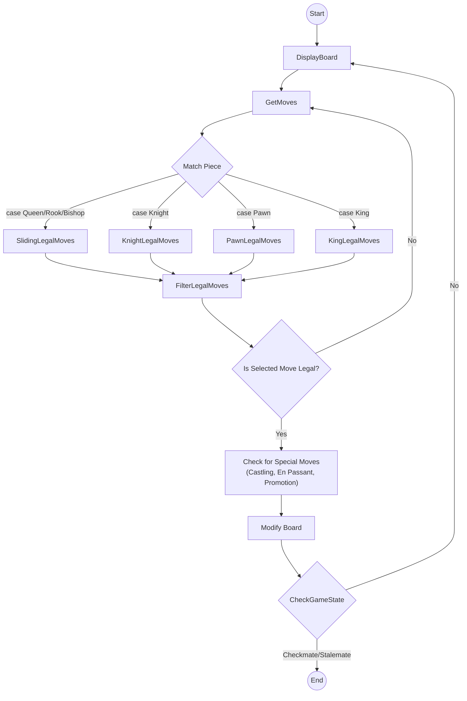

# Chess Program
### A Command-Line Chess Application that allows two players to play chess using coordinate-based input

This program was built from scratch in Python to explore programming fundamentals, data structures and the implementation of chess rules without relying on external chess libraries

#### <ins>Features:</ins>
- Board Representation
- Turn Management
- Legal Move Generation (for all pieces)
- Captures
- Check Detection
- Checkmate
- Stalemate
- Castling
- Castling Rights
- En Passant
- Pawn Promotion
- King Safety Checks
- Half Move Clock
- Full Move Number
- FEN

## Program Flow

